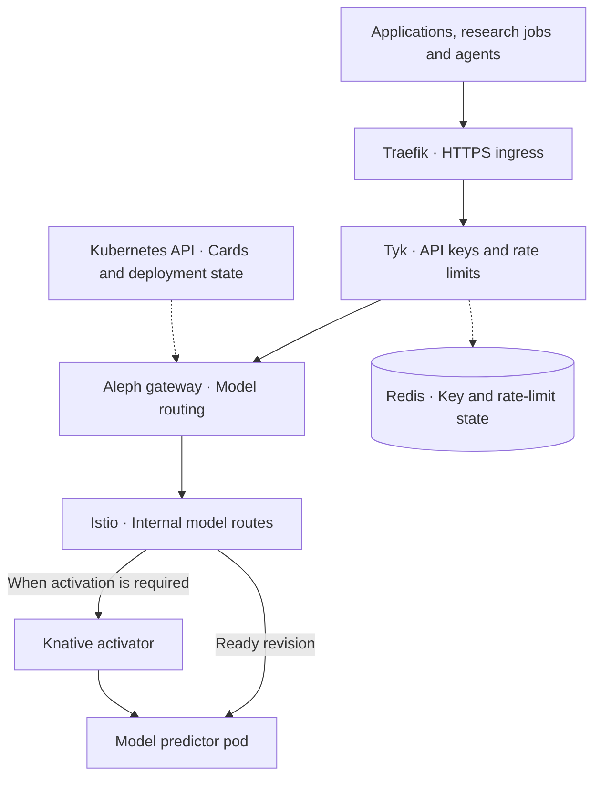
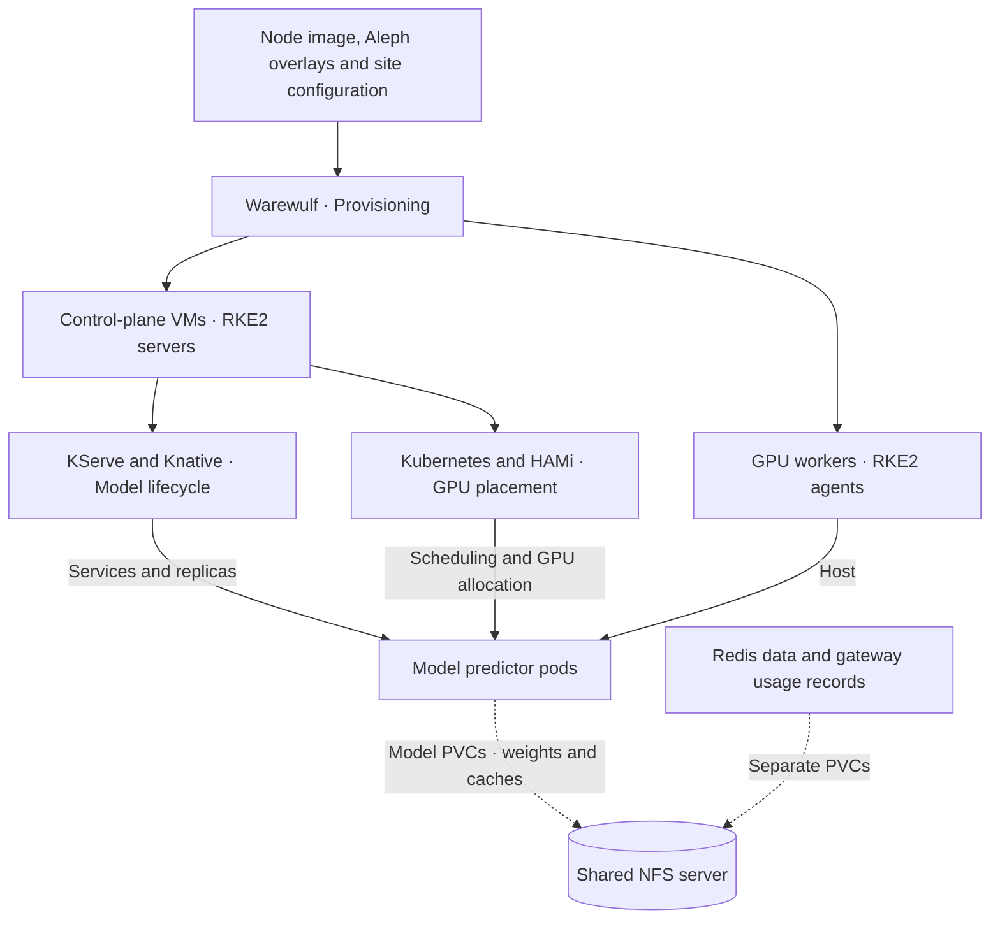

  

# Aleph — The Science Inference Cluster

> **Over 100 model deployments — one endpoint, one key, from protein folds to LLMs.**
>
> *One point. Every model. Infinite unity.*

*Deployed on the [University of Alberta](https://www.ualberta.ca/en/information-services-and-technology/research-computing/index.html) / [AMII](https://www.amii.ca/) Vulcan environment for multi-model GPU inference*

**Maintained by:** Rahim Khoja ([khoja1@ualberta.ca](mailto:khoja1@ualberta.ca)) and Karim Ali ([kali2@ualberta.ca](mailto:kali2@ualberta.ca))

[Get started](#get-started) · [Models](#model-catalog) · [Architecture](#architecture) · [Documentation](#documentation)

[Live catalog](https://inference.vulcan.alliancecan.ca/) · [Browser chat](https://llm.vulcan.alliancecan.ca/) · [API access guide](https://docs.alliancecan.ca/wiki/aleph)

---

## Overview

Aleph is a local inference server. It serves AI models much like a web server
serves content: send a request over HTTP and receive text, an image, a prediction,
or another model-specific result. The hosted models run on hardware we operate
on Vulcan.

Compatible tools use the same API formats they already support: change the server
address, supply an Aleph API key, and name the model. A notebook, research pipeline,
browser application, or agent can use the service without managing its own model
weights, software environment, or GPU allocation.

Researchers share running model servers, avoiding repeated setup and loading for
each workflow. The model stays loaded while in use; idle models can release their
GPU resources while retaining their weights on persistent storage. The researcher
chooses the right model and evaluates its results; Aleph handles serving it.

## Capabilities

- **Science and language models** — protein structure, genomics, materials, weather,
  medical imaging, and other scientific tasks alongside chat, vision, and audio.
- **Compatible APIs** — OpenAI-style chat and embeddings, Anthropic-style messages,
  and model-specific science endpoints. Check each card for supported inputs and features.
- **Flexible runtimes** — KServe manages deployment; vLLM, Text Embeddings
  Inference, NVIDIA NIM, or custom servers execute the models. A new API may need
  a gateway adapter; adding a supported model needs its deployment and card.
- **GPU sharing and scaling** — small models can share a GPU through HAMi, while
  larger models can request multiple devices. Adding workers expands the pool;
  starting more model copies shares demand within that pool. Both need capacity.
- **Always-on or on-demand** — selected models keep a running copy; others scale
  to zero when idle. A wake-up can return `503` with retry guidance, or a capacity
  refusal when the gateway cannot find a suitable placement.
- **Authentication and accounting** — Tyk handles API keys and rate limits; the
  gateway records caller identity, token counts, latency, status, and allocated
  resources, and exposes aggregate metrics. See [Logging and metrics](docs/LOGGING.md)
  for examples, content exclusions, and retention.
- **Persistent weights** — NFS-backed storage allows models to reuse downloaded
  weights across pod and node replacement.

## Get started

| I want to… | Start here |
|---|---|
| Find a model and see examples | [Live model catalog](https://inference.vulcan.alliancecan.ca/) |
| Chat in a browser | [Open WebUI](https://llm.vulcan.alliancecan.ca/) |
| Get API access | [Alliance Aleph guide](https://docs.alliancecan.ca/wiki/aleph) |
| Connect a notebook, SDK, or agent | [Endpoints and client configuration](docs/ENDPOINTS.md) |
| Deploy Aleph | [Deployment quickstart](QUICKSTART.md) |
| Add a model | [Model deployment and validation](docs/ADD-A-MODEL.md) |

Choose a model from the catalog, use its supported API, and supply your Aleph
key. Routing follows the model name you request. Each model card describes its
inputs, examples, and limitations.

The hosted service is a proof of concept with shared capacity and no SLA.

## Model catalog

Aleph hosts over 100 model deployments across scientific and language domains:

| Domain | Examples |
|---|---|
| **Protein / Structural biology** | AlphaFold2, Boltz-2, ESMFold, ESM2, ESM-C 300M, ProstT5, LigandMPNN, DiffDock, SaProt |
| **Genomics / DNA / RNA** | Nucleotide Transformer, DNABERT-2, GENA-LM, Borzoi, Enformer, Caduceus, RNAbert |
| **Materials / Chemistry** | MACE-MH-1, MACE-MP, CHGNet, ChemBERTa, MatterSim, CrystalLLM, ChemGPT |
| **Weather / Climate** | Aurora, GraphCast, FourCastNet3, Pangu-Weather, NeuralGCM, ClimaX, FengWu |
| **Astronomy** | AstroCLIP, AstroPT, AstroSage, Zoobot |
| **Medical / Imaging** | MedGemma, BiomedCLIP, TotalSegmentator, MedSAM, ClinicalBERT |
| **Vision / 3D** | FLUX.1, Kandinsky 3, DUSt3R, MASt3R, YOLOv8, Mask R-CNN, Depth Anything |
| **Time-series / Audio** | Chronos-Bolt, TimesFM, TTM, XTTS-v2, BirdNET, CLAP |
| **Language models** | Gemma 3/4, Qwen 3/3.5/3.6, GLM-4/Z1, GPT OSS 20B/120B, DeepSeek R1, Command-R |
| **Science NLP** | SciBERT, BioGPT, SciNCL, SpecTer2, OceanGPT, GeoGalactica, OpenBioLLM |

A repository entry does not guarantee that the model is currently served. Use the
[live catalog](https://inference.vulcan.alliancecan.ca/) for availability and each
model's README for its test status and limitations. Authenticated `GET /v1/models`
lists chat models; add `?all=true` for the full catalog. To contribute a deployment,
follow [Add a model](docs/ADD-A-MODEL.md).

## Architecture

Aleph has two main layers: a gateway that accepts and routes requests, and a
Kubernetes serving platform that runs the selected models. Warewulf provisions
the cluster; shared NFS storage keeps persistent data outside the pods.

### Request flow

Solid arrows show request traffic. Dotted connections show supporting state or
configuration.

Traefik terminates TLS and routes requests to Tyk. Tyk authenticates API calls,
applies limits, and supplies caller identity to the FastAPI gateway. The gateway
translates supported APIs and routes by model name using cards and deployment
state discovered through Kubernetes watches.

The gateway checks cold-start capacity before forwarding. A model waking up may
return `503` with retry guidance; a request may also be refused when suitable
capacity is unavailable. Knative can include its activator for activation and
buffering. Ready revisions can receive traffic directly through the model route.

### Provisioning and placement

Ingress and the gateway run on control-plane nodes; GPU predictors run on workers.
KServe and Knative manage services, revisions, and replica counts. Kubernetes and
HAMi place the pods and allocate shared GPU capacity or whole devices. These
controllers manage inference workloads; they are not extra request hops.
The dotted connections show persistent storage mounts.

### Supporting components

| Component | Role |
|---|---|
| MetalLB | Advertises the public service IP over L2 for Traefik's LoadBalancer Service. |
| cert-manager + Let's Encrypt | Issue and renew the TLS certificate using ACME HTTP-01. Traefik handles HTTPS and HTTP redirection. |
| Serving runtimes | A predictor's queue-proxy forwards requests to vLLM, TEI, NVIDIA NIM, or a custom serving container. |
| GPU worker stack | RKE2, containerd, NVIDIA drivers and container runtime, HAMi device plugin and monitoring. Network and RDMA support are covered in the system guide. |
| Shared NFS storage | Separate PVCs and directories hold Redis data, gateway usage records, and model weights, caches, and environments. |
| Usage and metrics | The gateway writes per-replica JSONL usage files and exposes aggregate counters at `/metrics`. Tyk's administrative audit and physical GPU telemetry are separate. |

Persistent files survive model scale-to-zero and node replacement; they still
need backups. Selected models can remain running, while others release GPU
resources when idle. More replicas or workers require available capacity.

Deployment details: [provisioning and storage](docs/WW-OVERLAYS.md),
[serving and scaling](docs/KUBERNETES.md), [worker system](docs/SYSTEM.md),
and [logging and metrics](docs/LOGGING.md).

Gateway releases are built by CI. Production deployments pin an image version
or digest; restarting a Deployment alone does not change that pin. Keep deployed
configuration and boot sources aligned.

## Documentation

| Guide | Purpose |
|---|---|
| [Quickstart](QUICKSTART.md) | Deploy an instance |
| [Add a model](docs/ADD-A-MODEL.md) | Our deployment and validation workflow |
| [Endpoints](docs/ENDPOINTS.md) | API paths and client configuration |
| [API keys](docs/TYK-USERS.md) | Authentication and identity |
| [Logging and metrics](docs/LOGGING.md) | Recorded data, examples, retention, and usage reports |
| [Warewulf](docs/WW-OVERLAYS.md) | Overlays, site settings, and storage |
| [Kubernetes](docs/KUBERNETES.md) | Serving components, placement, and model lifecycle |
| [System](docs/SYSTEM.md) | Boot integration, node services, and GPU/RDMA support |
| [Gateway reference](gateway/README.md) | Routing and model-card behavior |
| [Model definitions](models/) | Deployment manifests, model cards, and tests |
| [Gateway source](gateway/) | Implementation and tests |

## 🔗 References

- [University of Alberta Research Computing](https://www.ualberta.ca/en/information-services-and-technology/research-computing/index.html)
- [Warewulf/RKE2 node-image repository](https://github.com/ualberta-rcg/warewulf-rke2-hami)
- [RKE2 Kubernetes](https://docs.rke2.io/)
- [KServe](https://kserve.github.io/website/)
- [HAMi GPU sharing](https://project-hami.io/docs/)

---

## 🤝 Support

Many Bothans died to bring us this information. This project is provided as-is, but reasonable questions may be answered based on my coffee intake or mood. ;)

Feel free to open an issue or email **[khoja1@ualberta.ca](mailto:khoja1@ualberta.ca)** or **[kali2@ualberta.ca](mailto:kali2@ualberta.ca)** for U of A related deployments.

## 📜 License

This project is released under the **MIT License** — use it, modify it, distribute it, include it in proprietary software. Keep the copyright notice. That's it.

**Full license text:** [MIT License](./LICENSE)

## 🧠 About University of Alberta Research Computing

The [Research Computing Group](https://www.ualberta.ca/en/information-services-and-technology/research-computing/index.html) supports high-performance computing, data-intensive research, and advanced infrastructure for researchers at the University of Alberta and across Canada.

We help design and operate compute environments that power innovation — from AI training clusters to national research infrastructure.
