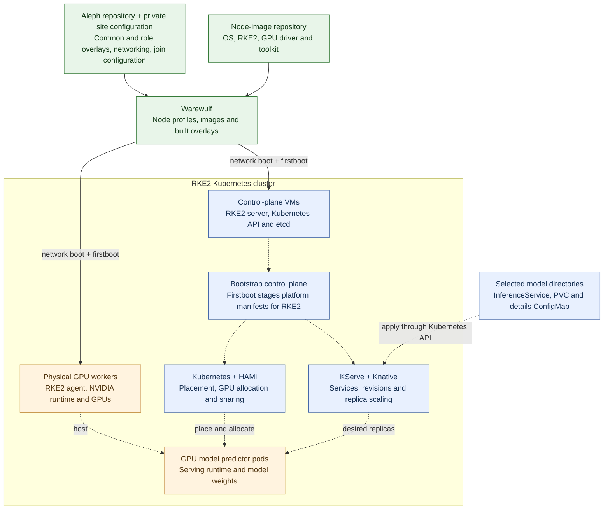
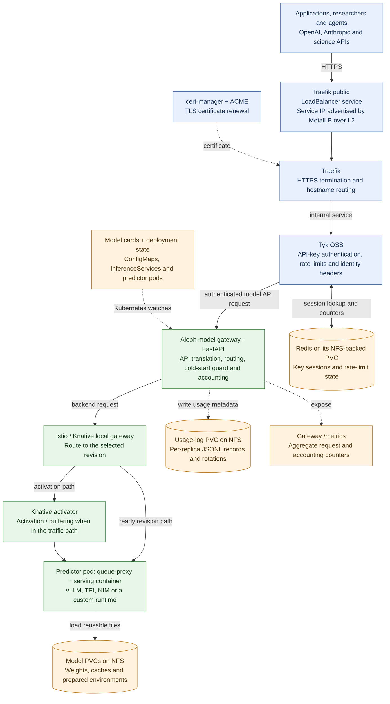

# Aleph — The Science Inference Cluster

> **Over 100 model deployments — one endpoint, one key, from protein folds to LLMs.**
>
> *One point. Every model. Infinite unity.*

*Deployed on the [University of Alberta](https://www.ualberta.ca/en/information-services-and-technology/research-computing/index.html) / [AMII](https://www.amii.ca/) Vulcan environment for multi-model GPU inference*

**Maintained by:** Rahim Khoja ([khoja1@ualberta.ca](mailto:khoja1@ualberta.ca)) and Karim Ali ([kali2@ualberta.ca](mailto:kali2@ualberta.ca))

---

## 📖 Description

Aleph is a local inference server. It serves AI models much like a web server
serves content: send a request over HTTP and receive text, an image, a prediction,
or another model-specific result. The hosted models run on hardware we operate
on Vulcan.

Compatible tools use the same API formats they already support: change the server
address, supply an Aleph API key, and name the model. A notebook, research pipeline,
browser application, or agent can use the service without managing its own model
weights, software environment, or GPU allocation.

Researchers share running model servers, avoiding repeated setup and loading for
each workflow. The model stays loaded while in use; idle models can release their
GPU resources while retaining their weights on persistent storage. The researcher
chooses the right model and evaluates its results; Aleph handles serving it.

## ✨ Features

- **Science and language models** — protein structure, genomics, materials, weather,
  medical imaging, and other scientific tasks alongside chat, vision, and audio.
- **Compatible APIs** — OpenAI-style chat and embeddings, Anthropic-style messages,
  and model-specific science endpoints. Check each card for supported inputs and features.
- **Flexible runtimes** — KServe manages deployment; vLLM, Text Embeddings
  Inference, NVIDIA NIM, or custom servers execute the models. A new API may need
  a gateway adapter; adding a supported model needs its deployment and card.
- **GPU sharing and scaling** — small models can share a GPU through HAMi, while
  larger models can request multiple devices. Adding workers expands the pool;
  starting more model copies shares demand within that pool. Both need capacity.
- **Always-on or on-demand** — selected models keep a running copy; others scale
  to zero when idle. A wake-up can return `503` with retry guidance, or a capacity
  refusal when the gateway cannot find a suitable placement.
- **Authentication and accounting** — Tyk handles API keys and rate limits; the
  gateway records caller identity, token counts, latency, status, and allocated
  resources, and exposes aggregate metrics. See [Logging and metrics](docs/LOGGING.md)
  for examples, content exclusions, and retention.
- **Persistent weights** — NFS-backed storage allows models to reuse downloaded
  weights across pod and node replacement.

## 🚀 Quickstart

- **Use the hosted service:** browse [models and examples](https://inference.vulcan.alliancecan.ca/),
  use [browser chat](https://llm.vulcan.alliancecan.ca/), or follow the
  [Alliance Aleph guide](https://docs.alliancecan.ca/wiki/aleph) for API access.
- **Deploy your own instance:** [QUICKSTART.md](QUICKSTART.md) covers requirements,
  configuration, provisioning, and first-model validation.
- **Add a model:** [the model workflow](docs/ADD-A-MODEL.md) covers runtime selection,
  deployment, testing, and recording the result.

The hosted service is a proof of concept with shared capacity and no SLA.

## 🔬 Model Catalog

Aleph hosts over 100 model deployments across scientific and language domains:

| Domain | Examples |
|---|---|
| **Protein / Structural biology** | AlphaFold2, Boltz-2, ESMFold, ESM2, ESM-C 300M, ProstT5, LigandMPNN, DiffDock, SaProt |
| **Genomics / DNA / RNA** | Nucleotide Transformer, DNABERT-2, GENA-LM, Borzoi, Enformer, Caduceus, RNAbert |
| **Materials / Chemistry** | MACE-MH-1, MACE-MP, CHGNet, ChemBERTa, MatterSim, CrystalLLM, ChemGPT |
| **Weather / Climate** | Aurora, GraphCast, FourCastNet3, Pangu-Weather, NeuralGCM, ClimaX, FengWu |
| **Astronomy** | AstroCLIP, AstroPT, AstroSage, Zoobot |
| **Medical / Imaging** | MedGemma, BiomedCLIP, TotalSegmentator, MedSAM, ClinicalBERT |
| **Vision / 3D** | FLUX.1, Kandinsky 3, DUSt3R, MASt3R, YOLOv8, Mask R-CNN, Depth Anything |
| **Time-series / Audio** | Chronos-Bolt, TimesFM, TTM, XTTS-v2, BirdNET, CLAP |
| **Language models** | Gemma 3/4, Qwen 3/3.5/3.6, GLM-4/Z1, GPT OSS 20B/120B, DeepSeek R1, Command-R |
| **Science NLP** | SciBERT, BioGPT, SciNCL, SpecTer2, OceanGPT, GeoGalactica, OpenBioLLM |

A repository entry does not guarantee that the model is currently served. Use the
[live catalog](https://inference.vulcan.alliancecan.ca/) for availability and each
model's README for its test status and limitations. Authenticated `GET /v1/models`
lists chat models; add `?all=true` for the full catalog. To contribute a deployment,
follow [Add a model](docs/ADD-A-MODEL.md).

## 🏗️ Architecture

The diagrams reflect the running deployment checked on **2026-09-13**, together
with its Warewulf boot sources. Site addresses and hardware counts are kept in
private operating notes.

**Provisioning and model deployment**

Warewulf supplies the operating environment for both control-plane VMs and physical
GPU workers. RKE2 then manages the cluster; model deployments are applied separately.
Dotted arrows below show configuration and management relationships.

Ingress and the Aleph gateway run on control-plane nodes; GPU model predictors
run on workers. The bootstrap node stages `/etc/rancher/manifests/` into RKE2's auto-deploy directory.
The node image supplies drivers; HAMi supplies GPU allocation and sharing. Git,
rendered boot sources, and running configuration must agree for changes to survive
reprovisioning. See [Warewulf](docs/WW-OVERLAYS.md) and [System](docs/SYSTEM.md).

**Requests, discovery, and persistent data**

Solid arrows show requests or data access; dotted arrows show configuration,
discovery, and accounting. The serving path includes an activator when needed;
KServe and Knative's controllers manage that path rather than proxying every call.

Tyk requires keys for `/v1/` and `/anthropic/`; its root web route is keyless.
The gateway can return `503` with retry guidance before forwarding when a model
is asleep or capacity appears unavailable. Knative controls replica counts;
Kubernetes and HAMi must still find resources for them.

NFS data survives pod replacement and model scale-to-zero. Redis key state, model
weights, and gateway usage records use separate claims. The admin command's audit
file is separate again. Prometheus counters need a collector for historical charts;
they do not measure physical GPU utilization. See [Kubernetes](docs/KUBERNETES.md),
[Tyk](docs/TYK-USERS.md), and [Logging and metrics](docs/LOGGING.md).

Gateway releases are built by CI and deployed with an explicit image version/digest.
A diagram describes the component relationships; it does not imply every fresh
installation reproduces all live settings. Known configuration gaps belong in the
owning infrastructure guides.

## 📚 Docs

| Guide | Purpose |
|---|---|
| [Quickstart](QUICKSTART.md) | Deploy an instance |
| [Add a model](docs/ADD-A-MODEL.md) | Our deployment and validation workflow |
| [Endpoints](docs/ENDPOINTS.md) | API paths and client configuration |
| [API keys](docs/TYK-USERS.md) | Authentication and identity |
| [Logging and metrics](docs/LOGGING.md) | Recorded data, examples, retention, and usage reports |
| [Warewulf](docs/WW-OVERLAYS.md) | Overlays, site settings, and storage |
| [Kubernetes](docs/KUBERNETES.md) | Serving components, placement, and model lifecycle |
| [System](docs/SYSTEM.md) | Boot integration, node services, and GPU/RDMA support |
| [Gateway reference](gateway/README.md) | Routing and model-card behavior |

## 🔗 References

- [University of Alberta Research Computing](https://www.ualberta.ca/en/information-services-and-technology/research-computing/index.html)
- [Alberta Machine Intelligence Institute (AMII)](https://www.amii.ca/)
- [Digital Research Alliance of Canada](https://alliancecan.ca/)
- [HAMi — GPU allocation and sharing](https://project-hami.io/docs/)
- [Warewulf/RKE2/HAMi node-image repository](https://github.com/ualberta-rcg/warewulf-rke2-hami)
- [Warewulf provisioning and overlays](https://warewulf.org/docs/main/)
- [RKE2 Kubernetes documentation](https://docs.rke2.io/)
- [KServe model serving](https://kserve.github.io/website/)
- [Knative Serving and autoscaling](https://knative.dev/docs/serving/)
- [Tyk API gateway documentation](https://tyk.io/docs/)

---

## 🤝 Support

Many Bothans died to bring us this information. This project is provided as-is, but reasonable questions may be answered based on my coffee intake or mood. ;)

Feel free to open an issue or email **[khoja1@ualberta.ca](mailto:khoja1@ualberta.ca)** or **[kali2@ualberta.ca](mailto:kali2@ualberta.ca)** for U of A related deployments.

## 📜 License

This project is released under the **MIT License** — use it, modify it, distribute it, include it in proprietary software. Keep the copyright notice. That's it.

**Full license text:** [MIT License](./LICENSE)

## 🧠 About University of Alberta Research Computing

The [Research Computing Group](https://www.ualberta.ca/en/information-services-and-technology/research-computing/index.html) supports high-performance computing, data-intensive research, and advanced infrastructure for researchers at the University of Alberta and across Canada.

We help design and operate compute environments that power innovation — from AI training clusters to national research infrastructure.
